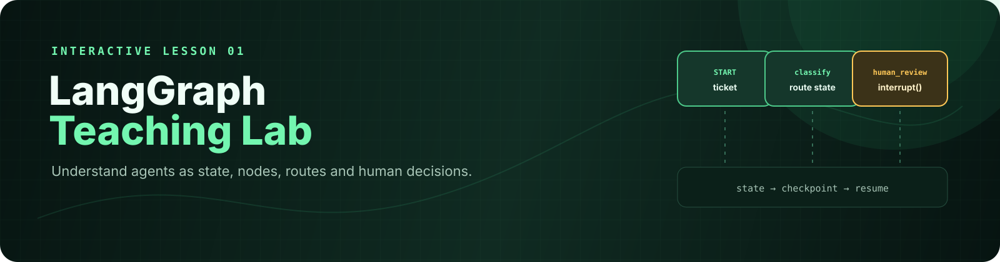

# LangGraph Teaching Lab

> Un laboratoire pratique en français pour comprendre, étape par étape, comment construire un agent avec LangGraph.

<p align="center">
  
</p>

Ce projet accompagne un cours d'introduction aux agents IA. Il transforme un ticket fictif de support client en une exécution observable : le ticket est classé, le contexte pertinent est récupéré, une réponse est préparée, puis une validation humaine est demandée lorsque le sujet est sensible.

Le laboratoire est volontairement petit et lisible. Chaque nœud du graphe correspond à une idée que l'on peut expliquer, modifier et tester.

## Ce que vous allez apprendre

À la fin du laboratoire, vous saurez :

- modéliser un état partagé avec `TypedDict` ;
- transformer une fonction Python en nœud LangGraph ;
- relier des nœuds avec des arêtes normales et conditionnelles ;
- compiler un graphe avec un checkpointer ;
- comprendre le rôle du `thread_id` dans la mémoire d'une exécution ;
- interrompre un graphe avec `interrupt()` ;
- reprendre la même exécution avec `Command(resume=...)` ;
- séparer la logique métier d'un appel OpenAI ;
- observer le chemin parcouru et les événements produits par le graphe.

## Le scénario pédagogique

```text
START
  |
  v
classify --> retrieve_context --> draft_reply
                                      |
                         +------------+------------+
                         v                         v
                   human_review                finalize
                         |                         |
                         +------------+------------+
                                      v
                                     END
```

Les tickets sont classés en quatre catégories : `billing`, `technical`, `account` et `other`.

- Un ticket technique ou général est finalisé automatiquement.
- Un ticket de facturation ou de compte passe par `human_review`.
- Le graphe sauvegarde son état avant la pause.
- Le même `thread_id` permet de reprendre exactement cette exécution après `approve` ou `reject`.

## Prérequis

- Python 3.10 ou une version plus récente ;
- un terminal ;
- aucune clé API pour le mode démo et les tests ;
- une clé OpenAI uniquement pour l'exercice du mode réel.

## Installation

Depuis la racine de ce laboratoire :

```bash
cd /Users/user/Documents/Projects/crm-agent/langgraph-teaching-lab
python3 -m venv .venv
.venv/bin/pip install -r requirements.txt
```

Toutes les commandes ci-dessous utilisent `.venv/bin/python` afin d'éviter les erreurs liées à un mauvais environnement Python.

## Parcours recommandé pour le cours

### 1. Commencer par le mode terminal déterministe

Ce mode ne fait aucun appel réseau. Il est idéal pour la première démonstration :

```bash
.venv/bin/python -m lab.cli --ticket "The mobile app shows an error"
```

Observez la catégorie `technical`, puis la réponse finale. Ensuite, essayez un ticket qui doit être contrôlé par une personne :

```bash
.venv/bin/python -m lab.cli --ticket "I was charged twice"
```

Lorsque le programme affiche `Decision (approve/reject)`, saisissez `approve` ou `reject`, puis appuyez sur Entrée. Demandez aux étudiants : « Qu'est-ce qui a été conservé pendant la pause ? »

### 2. Observer le graphe dans l'interface visuelle

```bash
./run-visual.sh
```

Ouvrez ensuite <http://127.0.0.1:8765>. L'interface affiche le graphe, les nœuds exécutés, la catégorie, le brouillon, les événements et les boutons de validation humaine.

Pour utiliser un autre port :

```bash
./run-visual.sh --port 8766
```

Le terminal doit rester ouvert pendant l'utilisation. Si le navigateur ne s'ouvre pas automatiquement, copiez l'URL affichée.

### 3. Lire le code dans l'ordre suivant

1. `lab/graph.py` — l'état, les nœuds, les transitions et le checkpoint ;
2. `lab/cli.py` — le déroulement d'une exécution dans le terminal ;
3. `lab/web.py` — les endpoints `POST /api/run` et `POST /api/resume` ;
4. `web/` — l'interface qui visualise l'exécution ;
5. `lab/openai_runtime.py` — l'adaptateur vers OpenAI, côté serveur uniquement.

## Mode réel avec OpenAI

Le mode réel remplace la classification et la rédaction déterministes par des appels OpenAI. La clé doit rester dans une variable d'environnement ou dans le fichier `.env` prévu par le projet CRM parent :

```text
/Users/user/Documents/Projects/crm-agent/.env
```

Ne copiez jamais cette clé dans le README, dans `web/`, dans le navigateur ou dans GitHub.

Pour lancer une exécution réelle dans le terminal :

```bash
.venv/bin/python -m lab.cli --real \
  --ticket "The mobile app shows an error on my phone"
```

Le mode visuel active le mode réel par défaut. Pour revenir au mode démo sans API :

```bash
LANGGRAPH_USE_OPENAI=false .venv/bin/python -m lab.web --no-open
```

Une exécution réelle peut effectuer deux appels API — classification puis rédaction — et consommer du crédit.

## Exercices à réaliser

### Exercice 1 — Ajouter une catégorie

Ajoutez une catégorie `shipping`, ses mots-clés et sa politique dans `lab/graph.py`. Écrivez d'abord un test qui décrit le comportement attendu, puis implémentez-le.

### Exercice 2 — Ajouter un spécialiste

Créez un nœud `shipping_specialist` et une arête conditionnelle. Vérifiez dans l'interface visuelle que seul le bon chemin est exécuté.

### Exercice 3 — Introduire un niveau de risque

Demandez une validation humaine seulement au-dessus d'un seuil de risque. Discutez des limites d'une règle déterministe.

### Exercice 4 — Rendre la mémoire durable

Remplacez `InMemorySaver` par SQLite ou PostgreSQL. Comparez l'état avant et après le redémarrage du serveur.

### Exercice 5 — Comparer démo et modèle

Exécutez le même ticket en mode déterministe puis en mode réel. Comparez la catégorie, la réponse, le coût et la reproductibilité.

## Comprendre l'état et la mémoire

Un état simplifié peut ressembler à ceci :

```python
{
    "ticket": "I was charged twice",
    "category": "billing",
    "context": ["Billing policy: ..."],
    "draft": "...",
    "events": ["classified:billing", "context_retrieved"],
}
```

`InMemorySaver` conserve les checkpoints pendant la vie du processus. Le `thread_id` identifie la conversation. Cette mémoire est volatile : un redémarrage efface les threads.

## Tests et inspection

Les tests couvrent la fin automatique, l'interruption/reprise et la conservation du checkpoint :

```bash
.venv/bin/pytest -q
```

Résultat attendu : `3 passed`. Les tests n'utilisent pas OpenAI.

Pour afficher la structure du graphe :

```bash
.venv/bin/python -m lab.graph
```

## Dépannage

| Symptôme | Solution |
|---|---|
| `python: command not found` | Utiliser `.venv/bin/python`. |
| `No module named lab` | Exécuter la commande depuis ce dossier. |
| Port `8765` occupé | Relancer avec `./run-visual.sh --port 8766`. |
| `OPENAI_API_KEY_NOT_CONFIGURED` | Vérifier la configuration côté serveur ; ne jamais mettre la clé dans le code client. |
| Le graphe s'arrête après redémarrage | C'est attendu avec `InMemorySaver` ; faire l'exercice de persistance durable. |

## Références

- [LangGraph — Persistence](https://docs.langchain.com/oss/python/langgraph/persistence)
- [LangGraph — Interrupts](https://docs.langchain.com/oss/python/langgraph/interrupts)
- [OpenAI — Developer quickstart](https://platform.openai.com/docs/quickstart/make-your-first-api-request)

## Données, sécurité et limites

Le projet utilise uniquement des tickets fictifs. N'y placez pas de données personnelles ou confidentielles. Une application de production doit ajouter une authentification, une validation stricte des entrées, une limitation de débit, une persistance maîtrisée et une politique de protection des données.

## Licence

Projet pédagogique. Voir les conditions du dépôt parent pour les règles de distribution.
